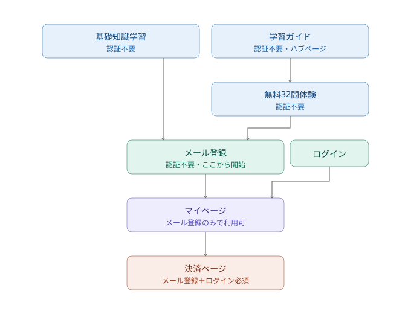
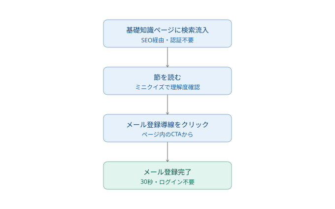
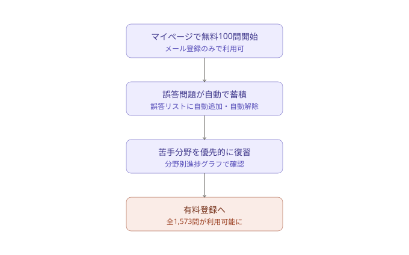
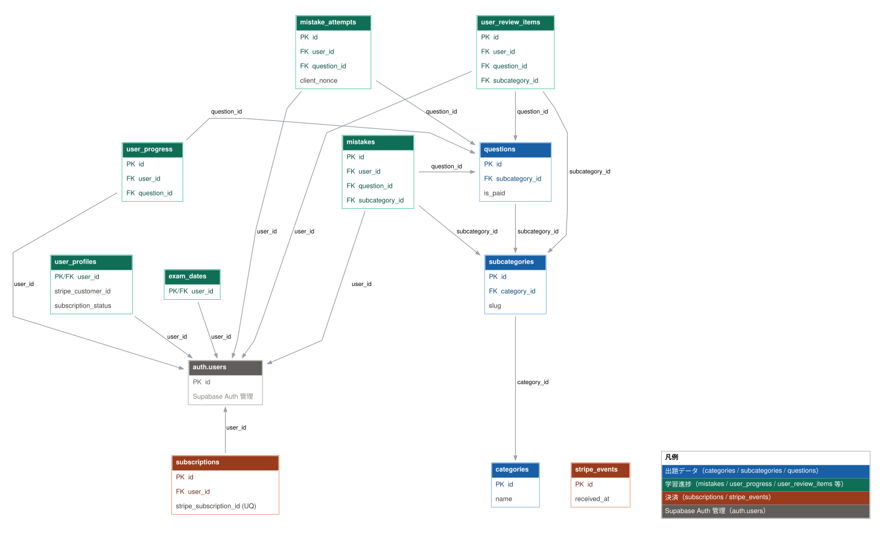
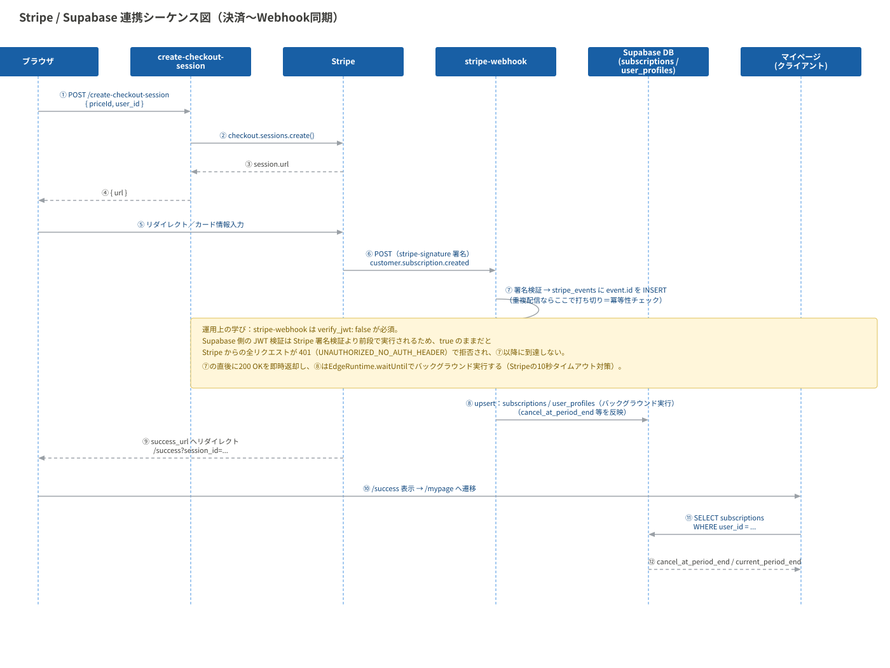

# 危険物乙4試験対策 — 弱点特化型学習プラットフォーム

危険物取扱者乙種第4類（乙4）の受験者向けに、誤答・復習リストと分野別進捗の可視化により
「弱点を優先的に潰す」学習フローを実現したWebサービスです。
Next.js（App Router）・Supabase・Stripeを用いて、認証・決済・進捗管理を含む
フルスタックの個人開発として、要件定義から実装・運用まで単独で担当しました。

**公開サイト**: [https://kikenbutsu-z4.com](https://kikenbutsu-z4.com)（本リポジトリを2026年8月にVercelへ本番デプロイ・ドメイン移行済み）

## 1. プロジェクト概要（要件定義）

## 背景

危険物取扱者乙種第4類（乙4）は年間約20万人が受験する国家資格だが、合格率は3〜4割程度と低く、多くの受験者が複数回受験を経験する。一方で試験範囲自体は法改正の影響を受けにくく、出題内容が長期間にわたって大きく変化しない分野である。このため、教材としての改修コストが低く、長期的に安定した需要が見込める領域として本プロジェクトを選定した。

## 対象ユーザー（ペルソナ）
- 社会人で、就業しながら学習時間を確保する必要がある
- 乙4受験の経験があり、過去に不合格を経験している
- 独学で学習を進めており、自分の弱点分野を客観的に把握できていない
- 継続学習が苦手で、モチベーションの維持に課題がある

## 課題
既存の教材の多くは、問題を解く機能自体は提供するが、「どの分野が弱点か」「何を優先して復習すべきか」を可視化する仕組みが弱い。受験者は同じ範囲を何度も反復しても、弱点そのものが埋まらないまま再受験を繰り返すケースが多い。

## 解決アプローチ
以下の機能により、「弱点を可視化し、優先的に潰す」という学習フローを実現した。

マイページでの分野別正答率のグラフ表示（弱点の可視化）
- 誤答リスト（不正解時に自動追加、正解で自動解除）
- 復習リスト（ユーザーが任意で追加）
- 試験日カウントダウン（残り日数の明確化）

## 2. 機能一覧

| カテゴリ | 認証条件 | 機能 |
|---|---|---|
| 基礎知識学習 | 不要 | 節ごとのミニクイズ付き解説ページ（法令・物理化学・性質と火災予防 全3章） |
| 練習問題（無料体験） | 不要 | 無料32問体験（静的データ、簡易版のヒント・解説） |
| マイページ | メール登録のみ（ログイン不要） | ①大分野・小分野別の練習問題（大分野タップで該当分野からランダム出題、小分野タップで該当節のみ出題）　②誤答リストUI　③復習リストUI　④学習カレンダー　⑤試験日カウントダウン　⑥分野別進捗グラフ　⑦サブスクリプション購入への導線 |
| 決済・会員管理 | メール登録＋ログイン | Stripeサブスクリプション決済、請求情報確認、Webhookによる状態同期 |
| メール登録・ログイン | ― | メール登録（サインアップ）、ログイン、パスワードリセット |
| 法務・SEO | 不要 | プライバシーポリシー（問い合わせ先記載）、利用規約、特商法表記、OGP設定 |

## 3. 基本設計（画面遷移図・ユーザーフロー）

### 画面遷移図

### ユーザーフロー

**検索流入からメール登録まで**

**マイページ利用開始から有料転換まで**

## 4. 詳細設計 （DBスキーマ、API設計、Stripe/Supabase連携のシーケンス図）

### ER図（DBスキーマ）

### シーケンス図（決済〜Webhook同期）

### 設計判断のハイライト

#### ① サブスクリプション契約履歴の保持設計

**改善前**
`subscriptions`テーブルは`user_id`にUNIQUE制約を持つ設計だった。1ユーザーにつき常に1行のみを保持する構造。

**改善後**
UNIQUE制約を`user_id`から`stripe_subscription_id`に変更。1ユーザーが複数のサブスクリプション行を持てる構造にした。

**理由**
`user_id`にUNIQUE制約がある設計では、ユーザーが解約後に再契約した場合、Stripeの新しいサブスクリプションIDを受け取っても既存の1行を上書きするしかなく、過去の契約履歴（いつ解約し、いつ再契約したか）が失われる。将来的な問い合わせ対応や解約率の分析に必要な情報が構造上残せない設計だった。制約の対象を`stripe_subscription_id`に変えることで、Stripe側の実際の契約単位とDB側の行が1対1に対応し、履歴が自然に蓄積される設計に改めた。

#### ② Stripe Webhookの冪等性チェック

**改善前**
Stripeから送信されるWebhookイベントを受信する`stripe-webhook`関数側に、イベントの重複処理を防ぐ仕組みがなかった。

**改善後**
`stripe_events`テーブルを追加し、受信したイベントIDを主キーとして記録。Webhook処理の冒頭でこのテーブルに`INSERT`を試み、既に同じイベントIDが存在する場合（重複配信）は後続の更新処理をスキップするようにした。

**理由**
Stripeの公式仕様では、Webhookは「少なくとも1回」配信されることが保証されているが、「ちょうど1回」は保証されていない。ネットワーク遅延やタイムアウトにより、同一イベントが複数回配信されるケースが実際に発生しうる。冪等性チェックがない場合、サブスクリプションの状態更新処理が同じイベントに対して複数回走り、`current_period_end`の不整合やstreak・ポイント計算の二重加算といった実害につながる。`stripe_events`テーブルをイベントIDでのUNIQUE制約付きの記録台帳として使うことで、二重処理を構造的に防いだ。

#### ③ mistakesテーブルの不変性保護

**改善前**
`mistakes`テーブルには`(user_id, question_id)`にUNIQUE制約（`uq_mistakes_user_question`）があり、1ユーザー・1問題につき1行のみが対応する設計だった。しかし、この行の同一性を担保する`user_id`・`question_id`・`client_nonce`をDBレベルでUPDATEから保護する仕組みがなく、アプリケーション側の実装次第で、既存の`mistakes`行がまったく別のユーザー・別の問題を指すよう書き換えられてしまう余地があった。

**改善後**
`BEFORE UPDATE`トリガー`trg_mistakes_protect_immutable`を追加。`user_id`・`question_id`・`client_nonce`のいずれかが変更されようとした場合に例外を投げ、UPDATE自体を拒否するようにした。

**理由**
`mistakes`の各行は「このユーザーがこの問題を間違えた」という事実そのものを表しており、`user_id`・`question_id`はその行のアイデンティティに相当する。誤答の記録・解除は`INSERT`・`DELETE`で行うべきものであり、これらのカラムを`UPDATE`で書き換える正当な業務要件は存在しない。アプリケーション側のバグ（例えば誤ったUPSERT処理）が発生した場合、DB側に保護がなければ既存の誤答記録が別ユーザー・別問題のものとして静かに上書きされ、学習履歴の整合性が壊れるリスクがあった。DBレベルで不変性を強制することで、アプリケーション側の実装ミスに依存しない構造的な保護にした。

#### ④ 退会フローにおけるデータ整合性の統一

**改善前**
`mistakes`テーブルに論理削除用の`deleted_at`カラムが存在する一方、`user_progress`等の関連テーブルには論理削除の仕組みがなく、FKにも`ON DELETE CASCADE`が設定されていなかった。ユーザーが退会（`auth.users`からの削除）しても、`mistakes`は論理削除フラグが立つのみで物理的には残り、他の関連テーブルはFKの削除ルールが未設定のため、退会したはずのユーザーのデータが複数のテーブルに残り続ける状態だった。

**改善後**
`mistakes`から論理削除用インフラ（`deleted_at`等）を撤去し、`mistakes`・`mistake_attempts`・`user_review_items`等、ユーザーに紐づく全テーブルのFKに`ON DELETE CASCADE`を統一して設定した。`auth.users`の削除と同時に、関連する全テーブルのデータが自動的に物理削除される構成にした。

**理由**
論理削除と物理削除（CASCADE）が1つのテーブル群の中に混在すると、「退会済みユーザーのデータがどこまで残っているか」をテーブルごとに個別に把握しないと判断できず、削除漏れの温床になる。乙4のような学習データサービスでは、退会後もユーザーの誤答履歴等が特定の個人と紐づいた形でDBに残り続けることは、プライバシー・個人情報保護の観点で放置できないリスクである。削除ルールをFKレベルで`CASCADE`に統一したことで、「`auth.users`から消せば関連データも必ず消える」という単一の保証をDB構造そのものに持たせ、アプリケーション側の削除処理漏れに依存しない設計にした。

### API設計（Supabase Edge Functions）

Next.js側にはAPI Routesを持たず、Stripe秘密鍵の使用や外部API連携が必要な処理のみをSupabase Edge Functions（Deno）に集約している。単純なCRUD（誤答リスト・復習リスト等）は、Row Level Security（RLS）を前提にクライアントから直接PostgRESTへ問い合わせる構成とした。

| エンドポイント | メソッド | 認証 | 用途 |
|---|---|---|---|
| `create-checkout-session` | POST | 不要（`verify_jwt: false`） | Stripe Checkoutセッションを作成し、決済ページのURLを返す |
| `checkout-session-info` | POST | 不要（`verify_jwt: false`） | 決済完了後、`session_id`から決済ステータス・メールアドレスを取得（`/success`ページで使用） |
| `billing-portal` | POST | 必須（Supabase JWT） | Stripeカスタマーポータルのセッションを作成し、請求情報確認・サブスク解約導線を提供 |
| `check-guest-subscription` | POST | 必須（Supabase JWT） | ログイン前に決済したゲストユーザーのStripe契約を、メールアドレス突合でアカウントに紐付け |
| `request-account-deletion` | POST | 必須（Supabase JWT） | 退会予約。有料会員は契約終了日まで猶予する`deletion_requested`フラグを立て、無料会員は即時削除 |
| `cancel-account-deletion` | POST | 必須（Supabase JWT） | 退会予約の取り消し（`deletion_requested`フラグを戻す） |
| `stripe-webhook` | POST | Stripe署名検証（`verify_jwt: false`） | Stripeからのイベント通知を受信し、サブスク状態をDBに同期 |

#### リクエスト/レスポンス型定義

全エンドポイント共通のエラー形式を先に定義し、各エンドポイントの型はこれを参照する。

\`\`\`typescript
// 全エンドポイント共通のエラーレスポンス形式
type ErrorResponse = {
  error: string;    // UPPER_SNAKE_CASEのエラーコード（例: MISSING_PRICE_ID）
  message?: string; // Stripe/DBエラー時の詳細メッセージ（人間可読な補足情報）
};
\`\`\`

#### `create-checkout-session`

Stripe Checkoutセッションを作成する。`user_id`を任意項目にしているのは、未ログイン状態での購入（ゲスト決済）を許容するためで、ログイン後に`check-guest-subscription`でメールアドレス突合による紐付けを行う設計と対応している。

\`\`\`typescript
type CreateCheckoutSessionRequest = {
  priceId: string;
  user_id?: string;       // 未ログイン購入（ゲスト決済）時は省略可
  email?: string;
  success_url: string;
  cancel_url: string;
};

type CreateCheckoutSessionResponse = {
  url: string;  // Stripe Checkoutへのリダイレクト先
  id: string;   // Checkout Session ID
};
\`\`\`

**エラー**

| コード | ステータス | 発生条件 |
|---|---|---|
| `MISSING_PRICE_ID` | 400 | `priceId`が未指定 |
| `MISSING_REDIRECT_URL` | 400 | `success_url`/`cancel_url`のいずれかが未指定 |
| `PRICE_NOT_ALLOWED` | 400 | 環境変数`PRICE_IDS`の許可リストに含まれない`priceId`（`priceId`を含めて返却） |
| `INVALID_JSON` | 400 | リクエストボディがJSONとしてパース不能 |
| `METHOD_NOT_ALLOWED` | 405 | POST以外のメソッド |
| `STRIPE_ERROR` | 500 | Stripe API呼び出し失敗（`message`に詳細） |

#### `checkout-session-info`

決済完了後の`/success`ページで、Stripe Checkoutの`session_id`から決済結果を取得する。メールアドレスは`customer_details.email`を優先し、取得できない場合のみ追加でCustomerオブジェクトを取得する（Checkout完了直後は`customer_details`が未確定なケースがあるための保険的フォールバック）。このエンドポイントはセッション個人情報を返すため、`cache-control: no-store`を明示している。

\`\`\`typescript
type CheckoutSessionInfoRequest = {
  session_id: string;
};

type CheckoutSessionInfoResponse = {
  email: string | null;
  customer_id: string | null;
  status: string;           // Stripe Checkout Sessionのstatus（'open' | 'complete' | 'expired' など）
  payment_status: string;   // 'paid' | 'unpaid' | 'no_payment_required'
  subscription_id: string | null;
};
\`\`\`

**エラー**

| コード | ステータス | 発生条件 |
|---|---|---|
| `MISSING_SESSION_ID` | 400 | `session_id`が未指定 |
| `INVALID_JSON` | 400 | リクエストボディがJSONとしてパース不能 |
| `METHOD_NOT_ALLOWED` | 405 | POST以外のメソッド |
| `STRIPE_ERROR` | 500 | Stripe API呼び出し失敗（`message`に詳細） |

#### `request-account-deletion`

退会予約。リクエストボディは持たず、Supabase JWTのみで本人を特定する（`user_id`等をボディから受け取らない設計。フロントから偽装されたIDを信用しない）。

有料会員（`active`/`trialing`/`past_due`）と無料会員でレスポンスの形が分岐する。有料会員の場合、即時削除はしない。Stripe側の契約終了日（`current_period_end`）まで猶予を持たせる`deletion_requested`フラグを立て、ユーザー希望で退会予約（Stripe側の契約終了日での退会）をすることができる。無料会員は猶予する契約が存在しないため`auth.users`を即時削除する。この非対称性を1つのエンドポイントに集約したのは、フロント側が会員種別を意識せず同じボタン・同じAPI呼び出しで退会フローを完結できるようにするため。

\`\`\`typescript
// リクエストボディなし（Authorizationヘッダーのみ）

type RequestAccountDeletionResponse =
  | { scheduled: true; effective_date: string | null } // 有料会員：契約終了日まで猶予
  | { deleted: true };                                  // 無料会員：即時削除
\`\`\`

**エラー**

| コード | ステータス | 発生条件 |
|---|---|---|
| `UNAUTHORIZED` | 401 | JWTが無い、または無効 |
| `DB_ERROR` | 500 | `subscriptions`テーブルへの問い合わせ・更新失敗（`message`に詳細） |
| `SUBSCRIPTION_NOT_CANCELLED` | 400 | 有料会員かつStripe側で`cancel_at_period_end`が未設定（フロントのボタン制御がバイパスされても、Stripe側で解約手続きが完了していない退会予約を拒否する保険） |
| `DELETE_FAILED` | 500 | `auth.users`削除失敗（`message`に詳細） |
| `METHOD_NOT_ALLOWED` | 405 | POST以外のメソッド |

#### `stripe-webhook`

Stripeからのイベント通知を受信する。**リクエスト/レスポンスとも、他6エンドポイントとは形式が異なる。**

- リクエスト：JSONではなくStripeが生成する生のイベントペイロード。`stripe-signature`ヘッダーの署名検証（`stripe.webhooks.constructEventAsync`）でのみ認証し、Supabase JWTは使わない（呼び出し元がStripeのみで、フロントから直接叩かれることがないため）
- レスポンス：JSONではなく**プレーンテキスト**。Stripeはレスポンスのステータスコードのみを見てリトライ要否を判断するため、構造化されたエラーコードを返す必要がない

\`\`\`typescript
// リクエストボディ：Stripe.Event（stripe-signatureヘッダーで署名検証）

// レスポンス（プレーンテキスト、Content-Type指定なし）
// 200 "ok"              : 正常受理（実処理はバックグラウンドで継続）
// 200 "ok (duplicate)"  : stripe_eventsテーブルに同一event.idが既存（Stripeのリトライによる重複配信を無視）
// 400 "invalid signature" : 署名検証失敗
// 400 "handler error: ${message}" : 署名検証〜冪等性チェックまでの間の未捕捉例外
\`\`\`

**処理するイベント種別**

| イベント | 処理内容 |
|---|---|
| `checkout.session.completed` | `session.metadata.user_id`または`client_reference_id`から会員を特定し、`user_profiles`を更新。紐づくサブスクリプションがあれば同期 |
| `customer.subscription.created`/`updated`/`deleted` | `subscriptions`/`user_profiles`をStripeの最新状態に同期。`deleted`の場合、`deletion_requested`フラグが立っていれば`auth.users`を物理削除する（`request-account-deletion`が立てた予約フラグを、実際の契約終了タイミングでここが実行に移す2段階構成） |
| `invoice.paid`/`invoice.payment_succeeded` | 紐づくサブスクリプションを取得し同期 |
| それ以外 | 何もしない |

**冪等性の仕組み**

Stripeは同一イベントを複数回配信することがあるため、`stripe_events`テーブルに`event.id`を記録し、既存であれば処理をスキップする。

**設計判断：即時レスポンスとバックグラウンド処理の分離**

署名検証・冪等性チェック・イベント記録は同期的に完了させて`200`を即座に返し、Stripe APIへの追加呼び出しを伴う実同期処理（`user_profiles`/`subscriptions`更新、`auth.users`削除）は`EdgeRuntime.waitUntil()`でバックグラウンドに回している。Stripeの10秒タイムアウト・リトライ設計に対して、処理が重い場合でも安定してレスポンスできるようにするための対応。

#### `cancel-account-deletion`

`request-account-deletion`で立てた退会予約を取り消す。リクエストボディは持たず、JWTのみで本人を特定する点は`request-account-deletion`と同じ。

`request-account-deletion`との非対称性が1点ある：`request-account-deletion`は「サブスクリプション未登録＝無料会員」として即時削除に倒すが、`cancel-account-deletion`は行が無ければ`NO_SUBSCRIPTION`（404）で明示的に拒否する。これは「取り消す対象の予約が存在しない」ことを黙って200で返すと、フロントが誤操作に気づけなくなるための設計。既に取り消し済み（`deletion_requested`が既に`false`）の場合はエラーにせず、`already: true`を付けて200で返す（二重送信・多重クリックを異常系として扱わないため）。

\`\`\`typescript
// リクエストボディなし（Authorizationヘッダーのみ）

type CancelAccountDeletionResponse =
  | { cancelled: true; already?: true } // 取り消し成功（already: trueは元々取り消し済みだった場合）
\`\`\`

**エラー**

| コード | ステータス | 発生条件 |
|---|---|---|
| `UNAUTHORIZED` | 401 | JWTが無い、または無効 |
| `NO_SUBSCRIPTION` | 404 | `subscriptions`テーブルに該当ユーザーの行が存在しない |
| `DB_ERROR` | 500 | `subscriptions`テーブルへの問い合わせ・更新失敗（`message`に詳細） |
| `METHOD_NOT_ALLOWED` | 405 | POST以外のメソッド |

#### `check-guest-subscription`

未ログイン状態で決済したゲストユーザーが、後からログイン（会員登録）した際に、メールアドレス突合でStripeの契約をアカウントに紐付ける。リクエストボディは持たず、JWTから取得したログイン中ユーザーのメールアドレスのみで検索する（`email`をリクエストボディから受け取らない設計。他人のメールアドレスを指定して契約を横取りされないようにするため）。

Stripe Customer検索→該当顧客ごとにサブスクリプション検索、という2段階のStripe API呼び出しを行い、`active`/`trialing`状態の契約が見つかった時点で`user_profiles`/`subscriptions`に同期して返す。複数のStripe顧客が同じメールアドレスを持つケース（ゲスト決済を複数回行った等）を想定し、ループで全顧客を走査している。

\`\`\`typescript
// リクエストボディなし（Authorizationヘッダーのみ）

type CheckGuestSubscriptionResponse =
  | { matched: true; subscription_id: string }
  | { matched: false; reason: "NO_CUSTOMER" | "NO_ACTIVE_SUBSCRIPTION" };
\`\`\`

**エラー**

| コード | ステータス | 発生条件 |
|---|---|---|
| `UNAUTHORIZED` | 401 | JWTが無い、または無効 |
| `NO_EMAIL_ON_ACCOUNT` | 400 | ログイン中ユーザーにメールアドレスが設定されていない |
| `STRIPE_ERROR` | 500 | Stripe API呼び出し失敗（`message`に詳細） |
| `METHOD_NOT_ALLOWED` | 405 | POST以外のメソッド |

#### `billing-portal`

Stripeカスタマーポータル（請求情報の確認・支払い方法の変更・サブスク解約）へのセッションURLを発行する。呼び出し前に、ログイン中ユーザーの`user_profiles.stripe_customer_id`をDBから引いており、リクエストボディからは`return_url`のみを受け取る（`customer_id`をクライアントから信用しない設計は他エンドポイントと共通）。

\`\`\`typescript
type BillingPortalRequest = {
  return_url: string; // ポータルから戻ってくる先のURL
};

type BillingPortalResponse = {
  url: string; // Stripeカスタマーポータルへのリダイレクト先
};
\`\`\`

**エラー**

| コード | ステータス | 発生条件 |
|---|---|---|
| `UNAUTHORIZED` | 401 | JWTが無い、または無効 |
| `PROFILE_LOOKUP_FAILED` | 500 | `user_profiles`テーブルへの問い合わせ失敗（`message`に詳細） |
| `NO_STRIPE_CUSTOMER` | 400 | `stripe_customer_id`が未登録（一度もStripe決済をしていないユーザー） |
| `MISSING_RETURN_URL` | 400 | `return_url`が未指定 |
| `STRIPE_ERROR` | 500 | Stripe API呼び出し失敗（`message`に詳細） |
| `METHOD_NOT_ALLOWED` | 405 | POST以外のメソッド |

#### 運用上の学び：`verify_jwt`とWebhook認証の落とし穴

`stripe-webhook`は当初`verify_jwt: true`でデプロイされており、SupabaseプラットフォームレベルのJWT検証が、関数のコードに到達する前に全リクエストを`401 UNAUTHORIZED_NO_AUTH_HEADER`で拒否していた。StripeのWebhookはSupabaseのJWTではなく独自の署名（`stripe-signature`ヘッダー）で認証するため、この設定では関数内の署名検証ロジックに一切到達できず、サブスクリプションの状態同期が機能しない状態が続いていた。

Edge Functionのログを確認し、Stripe側からのリクエスト自体は届いているが401で弾かれていることを特定。`supabase/config.toml`に`[functions.stripe-webhook] verify_jwt = false`を追加して解消した。あわせて、GitHub ActionsのデプロイワークフローがトリガーパスとしてEdge Functionsのコード（`supabase/functions/**`）のみを監視しており、`config.toml`単体の変更では自動デプロイが走らない設計上の穴も同時に発見し、トリガーパスに`supabase/config.toml`を追加して修正した。

## 5. 実装・技術スタック

### フロントエンド

| 技術 | バージョン | 採用理由 |
|---|---|---|
| Next.js（App Router） | 16.2.10 | Server Components前提の設計で、認証済みユーザー情報の取得をサーバー側に寄せられる。バニラJS版（`dangerous-materials-fe4`）からの移植先として選定し、現在は本番ドメイン`kikenbutsu-z4.com`で稼働中 |
| React | 19.2.4 | React Compilerがネイティブ対応する最新版。React 17/18でも`react-compiler-runtime`パッケージを追加すれば利用可能だが、19系であれば追加パッケージ無しでビルトインのランタイムAPIが使える |
| TypeScript | ^5 | `strict: true`。API設計のリクエスト/レスポンス型を明示する運用（4章参照）はTypeScriptの型システムを前提にしている |
| CSS Modules | - | コンポーネント単位でスタイルを閉じ込める目的で全面採用（92ファイル） |
| Tailwind CSS | v4 | デザイントークン（`--color-navy`等）の一元管理と、一部コンポーネントのユーティリティクラスに限定利用。CSS Modulesと併用し、レイアウト崩れが起きやすい細かい調整のみTailwindに寄せる方針 |
| Chart.js | ^4.5.1 | マイページの学習進捗グラフ描画 |

### バックエンド・インフラ

| 技術 | 役割 |
|---|---|
| Supabase（PostgreSQL） | メインDB。RLSでユーザーごとのデータアクセス制御 |
| Supabase Auth | 認証（JWT発行、`@supabase/ssr`でサーバー/クライアント両対応のセッション管理） |
| Supabase Edge Functions（Deno） | Stripe秘密鍵を扱う処理・外部API連携の集約先（4章のAPI設計参照） |
| Stripe | 決済・サブスクリプション管理 |
| Vercel | Next.jsアプリのホスティング（本番稼働中） |
| GitHub Actions | Edge Functionsのデプロイパイプライン（`supabase/functions/**`と`config.toml`の変更を検知して自動デプロイ） |

### 技術的なハイライト

**React Compilerの有効化とその設計判断**：`next.config.ts`で`reactCompiler: true`を設定し、`babel-plugin-react-compiler`をビルドパイプラインに組み込んでいる。React Compilerはビルド時の静的解析でコンポーネント・値の依存関係を追跡し、`useMemo`/`useCallback`/`React.memo`が担っていた再レンダリング抑制を自動生成コードに置き換える。手動メモ化への依存を排除する狙いは、依存配列の記述漏れによる再レンダリング抑制の失敗（バグとして顕在化しにくい）と、過剰な`useMemo`によるメモリオーバーヘッドの両方を、実装者のスキルに関係なく機械的に防げる点にある。レビュアー不在の個人開発では、このクラスのバグは気づかれないまま本番に残りやすいため、コンパイラに委譲する判断はリスク低減として合理的である。

**308リダイレクトによるSEO資産の保全**：バニラJS版からNext.js版への移行時、URL構造が変わったにもかかわらずリダイレクトを設定しておらず、Google Search Consoleにインデックス済みの66件のURLが404を返す状態になっていた。302（一時的リダイレクト）ではなく`next.config.ts`の`redirects()`で`permanent: true`を指定しているのは、Next.jsが恒久的リダイレクトに用いる**308**ステータスを返すためで、これにより検索エンジンに「恒久的な移転」であることを伝え、旧URLに蓄積されたインデックス評価・被リンク評価を新URLに引き継がせている。307/308が使われているのは、従来の301/302と異なりリダイレクト時にHTTPメソッドを変更しない仕様のため。`redirects()`はビルド時に解決され、Vercelのエッジ層でリダイレクトが完結するため、クライアントサイドでの一瞬の404表示やリダイレクトチェーンによる遅延が発生しない。

**Cookieベースのセッションリフレッシュ設計（`src/proxy.ts`）**：Next.js 16で`middleware.ts`は`proxy.ts`に名称変更されており（旧名のままだとビルドが警告なしに失敗する）、本プロジェクトは初期実装の段階からこれに対応済みである。セッション検証には`getSession()`ではなく`getUser()`を使用している。`getSession()`はローカルのCookieに保存された値をそのまま信頼するため、Cookieの偽装に対して脆弱であるのに対し、`getUser()`はSupabase Authサーバーに問い合わせてJWTを再検証するため、なりすましを防げる。また、Cookieの更新を`request.cookies`と`response.cookies`の両方に対して行っているのは、`request`側を更新しないと同一リクエスト内で後続実行されるServer Componentsが古いセッションを参照し続けてしまい、`response`側を更新しないとブラウザに新しいトークンが返らないため。この2段階の伝播はSupabase公式が明示的に要求している実装パターンであり、省略するとセッション切れの検知が遅延する。

## 6. テスト・品質保証 （今回のSuspenseケーススタディを含む）

## 7. 今後の課題

