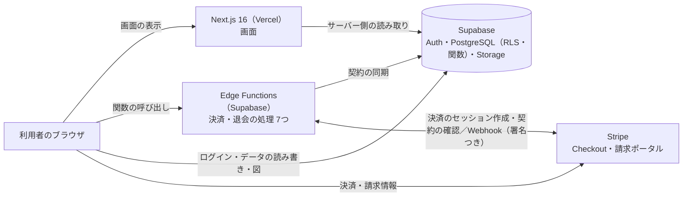
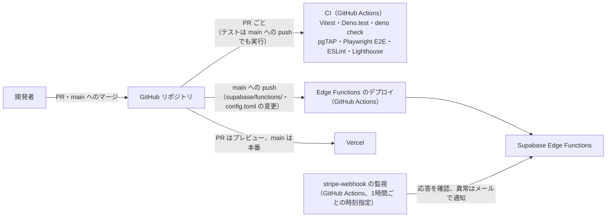

# 危険物乙4試験対策 — 弱点特化型学習プラットフォーム

危険物取扱者乙種第4類（乙4）の受験者向けに、誤答・復習リストと分野別進捗の可視化により
「弱点を優先的に潰す」学習フローを実現したWebサービスです。
Next.js（App Router）・Supabase・Stripeを用いて、認証・決済・進捗管理を含む
フルスタックの個人開発として、要件定義から実装・運用まで単独で担当しました。

**公開サイト**: [https://kikenbutsu-z4.com](https://kikenbutsu-z4.com)（本リポジトリを2026年8月にVercelへ本番デプロイ・ドメイン移行済み）

## 目次

- [要点](#要点)
- [全体構成](#全体構成)
- [主な設計判断](#主な設計判断)
- [テストの構成](#テストの構成)
- [非機能の要件](#非機能の要件)
- [動かし方](#動かし方)
- [ドキュメント](#ドキュメント)
- [技術スタック](#技術スタック)
- [今後の課題](#今後の課題)

## 要点

- 乙4受験者向けの有料学習サービス。誤答リスト・復習リスト・分野別正答率で「弱点を優先して潰す」学習フローを提供（本番稼働中）
- Next.js 16（App Router）＋ Supabase（PostgreSQL・RLS・Edge Functions）＋ Stripe。要件定義・設計・実装・運用を1人で担当
- データ設計：契約履歴を残す制約設計、Webhook の冪等性テーブル、誤答記録の不変性トリガー、退会時の CASCADE / SET NULL の使い分け。migrations から本番のスキーマを再現できることを `supabase db diff` で確認済み（[詳細設計](docs/design.md)）
- 障害対応：本番で起きた Webhook の 401 障害を、Stripe・Supabase のログ・GitHub Actions の履歴を突き合わせて特定し、復旧（[運用上の学び：verify_jwt と Webhook 認証の落とし穴](docs/operations.md#運用上の学びverify_jwtとwebhook認証の落とし穴)）
- テスト：分岐ロジックを関数に切り出し、Deno.test 45件・Vitest 31件・Playwright E2E 20件。DB の権限・RLS・関数は pgTAP 102件で検証。E2E はローカルの Supabase に分離し、本番に触れない構成（[テスト・品質保証](docs/testing.md)）。4種類のテストと ESLint、Edge Functions の型の検査（`deno check`）を、PR ごとに GitHub Actions で自動実行

## 全体構成

画面は Vercel 上の Next.js、認証・データ・決済まわりの処理は Supabase、決済は Stripe が担う。Stripe の秘密鍵を使う処理は Supabase Edge Functions だけに置いている（[API 設計](docs/api.md)）。

### 実行時の流れ


```mermaid
flowchart LR
  user["利用者のブラウザ"]
  next["Next.js 16（Vercel）<br/>画面"]
  ef["Edge Functions（Supabase）<br/>決済・退会の処理 7つ"]
  supa[("Supabase<br/>Auth・PostgreSQL（RLS・関数）・Storage")]
  stripe["Stripe<br/>Checkout・請求ポータル"]

  user -- "画面の表示" --> next
  user -- "関数の呼び出し" --> ef
  user -- "ログイン・データの読み書き・図" --> supa
  user -- "決済・請求情報" --> stripe
  next -- "サーバー側の読み取り" --> supa
  ef -- "契約の同期" --> supa
  ef <-->|"決済のセッション作成・契約の確認／Webhook（署名つき）"| stripe
  supa ~~~ stripe
```

### 開発・デプロイの流れ


```mermaid
flowchart LR
  dev["開発者"] -- "PR・main へのマージ" --> repo["GitHub リポジトリ"]
  repo -- "PR ごと<br/>（テストは main への push でも実行）" --> ci["CI（GitHub Actions）<br/>Vitest・Deno.test・deno check<br/>pgTAP・Playwright E2E・ESLint・Lighthouse"]
  repo -- "main への push<br/>（supabase/functions/・config.toml の変更）" --> deploy["Edge Functions のデプロイ<br/>（GitHub Actions）"]
  repo -- "PR はプレビュー、main は本番" --> vercel["Vercel"]
  deploy --> ef["Supabase Edge Functions"]
  watch["stripe-webhook の監視<br/>（GitHub Actions、1時間ごとの時刻指定）"] -- "応答を確認、異常はメールで通知" --> ef
```

## 主な設計判断

| | 判断 | 内容 |
|---|---|---|
| ① | 契約の履歴を残す | `subscriptions` の一意の制約を `user_id` から `stripe_subscription_id` に移し、解約・再契約の履歴を行として残す |
| ② | Webhook の重複を処理しない | 受け取ったイベントの ID を `stripe_events` に主キーで記録し、同じイベントが再び届いても二重に処理しない |
| ③ | 誤答の記録を書き換えさせない | `BEFORE UPDATE` のトリガーで、`mistakes` の `user_id`・`question_id`・`client_nonce` の書き換えを DB が拒否する |
| ④ | 退会時の削除を DB の制約にそろえる | 個人の記録のテーブルは `ON DELETE CASCADE`、`subscriptions` だけ `ON DELETE SET NULL` にし、契約の記録は個人と切り離して残す |
| ⑤ | 問題の公開を3段階に分ける | 無料体験32問（アプリに同梱）・無料会員100問・有料会員1,473問を、ログインの状態と RLS で分ける |
| ⑥ | DB の権限を絞る | ブラウザには読み取りだけを許し、書き込みは `auth.uid()` で本人を決める6つの関数に限る。権限は pgTAP で確かめる |
| ⑦ | 有料会員の判定を1か所にする | 4か所・2通りあった判定の条件を、DB の関数 `has_active_subscription()` に一本化する |

それぞれの改善前の状態、理由、確かめ方は [docs/design.md](docs/design.md#設計判断のハイライト) を参照。

## テストの構成

| 対象 | ツール | 件数 | 確かめていること |
|---|---|---|---|
| Edge Functions の判定 | Deno.test | 45件 | 決済・退会・Webhook の分岐（判定を `decision.ts` などに切り出して検証） |
| Next.js の関数 | Vitest | 31件 | 正誤の判定、ログイン後の移動先、Edge Functions の呼び出し、問題の図の URL、漏えいしたパスワードの案内 |
| DB | pgTAP | 102件（62ファイル） | ロールの権限、RLS、関数が本人の記録だけを使うこと |
| 画面の流れ | Playwright（E2E） | 20件 | 無料登録〜練習問題〜誤答リスト、有料会員の画面の出し分けなど。ローカルの Supabase で動かし、本番に触れない |

4種類のテストと、Edge Functions の型の検査（`deno check`）・ESLint・Lighthouse CI を、PR ごとに GitHub Actions で実行している。テストの方針とケーススタディは [docs/testing.md](docs/testing.md) を参照。

## 非機能の要件

### セキュリティ

- **DB の権限**：ブラウザには読み取りだけを許し、書き込みは `auth.uid()` で本人を決める6つの関数に限る。読める行は RLS で決める。権限は pgTAP で PR ごとに確かめる（[設計判断 ⑥](docs/design.md#設計判断のハイライト)）
- **本人の確定**：Edge Functions は、リクエストの JWT から本人を決め、本文のユーザー ID を使わない（[API 設計](docs/api.md)）
- **秘密の情報**：Stripe の秘密鍵・Webhook の署名の鍵は Edge Functions の環境変数だけに置き、Vercel（画面）には公開してよい値だけを置く（[本番の環境変数](docs/operations.md#本番の環境変数)）
- **Webhook**：Stripe の署名で送り主を確かめ、イベントの ID で重複を処理しない
- **パスワード**：過去に漏えいしたパスワードでの登録・変更を拒否する（Supabase Auth。HaveIBeenPwned との照合）
- **ログイン後の移動先**：サイトの中のパスだけを許し、外部のサイトへの誘導（オープンリダイレクト）を防ぐ

### 監視

- `stripe-webhook` の応答を GitHub Actions の1時間ごとの時刻指定で確かめ（実際の間隔は、GitHub の遅れ・飛ばしで3〜9時間）、異常は GitHub からメールで知らせる
- Stripe と GitHub の失敗の通知は、メールのフィルタで他のメールと分け、見落とさないようにしている（[運用上の学び](docs/operations.md#運用上の学びverify_jwtとwebhook認証の落とし穴)）

### バックアップ

- DB は Supabase が毎日バックアップし、7日分を残している（2026-10-05 にダッシュボードで確認）
- Storage のファイル（問題の図）は、DB のバックアップに含まれず、Storage のほかには保管していない（[今後の課題](#今後の課題)に挙げている）

### 性能

- 主要な4ページを、PR ごとに Lighthouse CI で3回ずつ測っている。直近（PR #75）の中央値は、Performance 98〜99、Accessibility 90〜96、CLS 0

### 運用の環境

- Vercel（Pro）、Supabase（Pro）

## 動かし方

### 必要なもの

- Node.js 22（CI と同じバージョン）
- Docker と Supabase CLI（ローカルの Supabase を起動するため）
- Deno 2.x（Edge Functions のテストを実行する場合のみ）

### ローカルで起動する

ローカルの Supabase を起動すると、`supabase/migrations/` のスキーマと、`supabase/seed.sql` の架空の問題データ（4問）が入る。本番の鍵は不要。

```bash
npm ci
supabase start
supabase status -o env    # API_URL と ANON_KEY を確認する
```

`.env.local` を作り、ローカルの値を設定する。

```
NEXT_PUBLIC_SUPABASE_URL=<supabase status の API_URL>
NEXT_PUBLIC_SUPABASE_ANON_KEY=<supabase status の ANON_KEY>
```

```bash
npm run dev                        # http://localhost:3000
```

決済（Stripe）と Edge Functions は、ローカル起動の対象外。

### テスト

```bash
# Next.js の単体テスト（Vitest、31件）
npm test -- --run

# Edge Functions の判定ロジック（Deno.test、45件）
deno test supabase/functions/

# E2E（Playwright、20件）。ローカルの Supabase を起動してから実行する
npx playwright install chromium    # 初回のみ
supabase start
npx playwright test

# DB の権限・RLS・関数のテスト（pgTAP、62ファイル・102件）。E2E と同じく、ローカルの Supabase に対して実行する
supabase test db

# lint（ESLint）
npm run lint
```

E2E の接続先は、`.env.local` ではなく `supabase status` から取得する。ローカルの Supabase が起動していない場合や、接続先がローカルでない場合は、テストを始める前に止まる。E2E は本番ビルド（`npm run build && npm run start`）を自動で起動してから実行する。

本番の環境変数は [docs/operations.md](docs/operations.md#本番の環境変数) を参照。

## ドキュメント

- [要件定義・基本設計](docs/requirements.md)：プロジェクト概要、機能一覧、画面遷移図・ユーザーフロー
- [詳細設計（DB・設計判断）](docs/design.md)：ER図、シーケンス図、設計判断のハイライト ①〜⑦、型安全性
- [API 設計](docs/api.md)：Supabase Edge Functions 7つのリクエスト・レスポンス
- [運用](docs/operations.md)：本番の環境変数、運用上の学び（Webhook の 401 障害、migration の履歴のずれ）
- [テスト・品質保証](docs/testing.md)：ケーススタディ、テスト戦略、カバレッジ、E2E の構成と方針

## 技術スタック

### フロントエンド

| 技術 | バージョン | 採用理由 |
|---|---|---|
| Next.js（App Router） | 16.2.10 | Server Components前提の設計で、認証済みユーザー情報の取得をサーバー側に寄せられる。バニラJS版（`dangerous-materials-fe4`）からの移植先として選定し、現在は本番ドメイン`kikenbutsu-z4.com`で稼働中 |
| React | 19.2.4 | React Compiler の実行時の部品（`react-compiler-runtime`）を追加せずに使うため、19系を採用（18以前は別に追加が必要。コンパイラ本体の `babel-plugin-react-compiler` はバージョンに関係なく必要） |
| TypeScript | ^5 | `strict: true`。API設計のリクエスト/レスポンス型を明示する運用（[API 設計](docs/api.md)参照）はTypeScriptの型システムを前提にしている |
| CSS Modules | - | コンポーネント単位でスタイルを閉じ込める目的で全面採用（92ファイル） |
| Tailwind CSS | v4 | デザイントークン（`--color-navy`等）の一元管理と、一部コンポーネントのユーティリティクラスに限定利用。CSS Modulesと併用し、レイアウト崩れが起きやすい細かい調整のみTailwindに寄せる方針 |
| Chart.js | ^4.5.1 | マイページの学習進捗グラフ描画 |

### バックエンド・インフラ

| 技術 | 役割 |
|---|---|
| Supabase（PostgreSQL） | メインDB。RLSでユーザーごとのデータアクセス制御 |
| Supabase Auth | 認証（JWT発行、`@supabase/ssr`でサーバー/クライアント両対応のセッション管理） |
| Supabase Edge Functions（Deno） | Stripe秘密鍵を扱う処理・外部API連携の集約先（[API 設計](docs/api.md)参照） |
| Stripe | 決済・サブスクリプション管理 |
| Vercel | Next.jsアプリのホスティング（本番稼働中） |
| GitHub Actions | PR ごとのテスト（Vitest・Deno.test・pgTAP・Playwright E2E）・Edge Functions の型の検査（`deno check`）・ESLint・Lighthouse CI の実行。Edge Functionsのデプロイパイプライン（`supabase/functions/**`と`config.toml`の変更を検知して自動デプロイ）。`stripe-webhook`の応答を1時間ごとの時刻指定で確かめる監視 |

### 技術的なハイライト

**React Compiler の有効化**：`next.config.ts` で `reactCompiler: true` を設定し、`babel-plugin-react-compiler` を組み込んでいる。メモ化はコンパイラに任せる方針にした。依存配列の書き漏れは表に出にくく、レビューする人がいない個人開発では本番に残りやすいため。

**308リダイレクトによる旧URLの引き継ぎ**：バニラJS版からの移行でURLの構造が変わり、Google Search Console でインデックス済みのURLが404を返していた。まず64件を設定し、その後 `/index.html`、設定漏れの3件（`defined_substances` など）、`/checkout.html` を順に追加して、現在は69件。`next.config.ts` の `redirects()` で `permanent: true` を指定し、308を返す。`source` に重複がないこと、本番で全件が308を返すことを `scripts/check_redirects.sh` で確かめた。

**Cookie によるセッションの更新（`src/proxy.ts`）**：Next.js 16 で middleware が proxy に改名されたため、最初から `proxy.ts` で実装している（ランタイムは Node.js）。ユーザーの確認には、Supabase Auth のサーバーで JWT を確かめる `getUser()` を使う。Cookie は Supabase の公式の手順どおり、`request` と `response` の両方で更新している。

## 今後の課題

### テスト

- E2E の有料転換フロー（Checkout のセッション作成〜決済完了後の Webhook による反映〜有料の問題の解放）。決済画面そのものの操作は、Stripe の公式ドキュメントの案内に従って自動テストの対象外とし、テストモードで手動で確認する
- `checkout-session-info`・`billing-portal` の E2E と、`useSearchParams` と Suspense 境界のケーススタディの E2E
- `src/lib` のうち Supabase の呼び出しを包むだけの関数（`account.ts`・`mistakes.ts`・`review.ts`・`progress.ts`）の単体テスト（判定ロジックの比率が低いため優先度は低い）

テストの構成と方針は [docs/testing.md](docs/testing.md) を参照。

### 型安全性

Stripe から返る値の一部（契約終了日）は、範囲を限定した型アサーション（`as unknown as PeriodEndSource`）で扱っており、実行時に値がその形をしている保証はコンパイラの外にある。抜本的な対応は、Basil 以降の API バージョンへの移行か、`zod` 等による実行時のスキーマ検証で、どちらも決済まわり全体への影響が大きいため保留している（経緯と対応済みの部分は [docs/design.md](docs/design.md#型安全性) を参照）。

### 決済とアカウントの紐付け

ログインせずに決済した場合、`check-guest-subscription` は、ログインしたアカウントのメールアドレスで Stripe の顧客を探す。そのため、既存のアカウントと別のメールアドレスで決済すると、契約がアカウントに結び付かない。購入画面では、ログインしていない人には「無料会員の方へ」として、ログインせずに別のメールアドレスで申し込むと有料プランが反映されないことを伝えてログインへ案内し（会員登録がまだの人には、そのまま申し込めることも示す）、ログインしている人には、申し込むアカウントのメールアドレスを表示している。ただし、案内を表示するだけで決済は止めていないため、ログインせずに別のメールアドレスで決済すると、契約がアカウントに結び付かない場合は今も残る。

### 運用タスク

- Stripe の記録と DB の記録を定期的に突き合わせ、イベントの記録の欠落を見つける仕組みの作成（[運用上の学び](docs/operations.md#運用上の学びverify_jwtとwebhook認証の落とし穴)の教訓を受けた次の対策。現在は `stripe-webhook` の応答を1時間ごとの時刻指定で確かめる監視までを入れている）
- `supabase/functions/`を独立したリポジトリへ切り出す作業（優先度は低く、緊急のバグ修正を優先してきたため未着手のまま）
- 旧バニラJS版（`dangerous-materials-fe4`）の Vercel プロジェクトの削除（Next.js 版への移行は完了済み。プロジェクトは未削除）
- Storage のファイル（問題の図、SVG 33個）のバックアップ。DB のバックアップに含まれず、今は Supabase の Storage にしかない

### コンテンツ構造

現状、`/basics`配下の解説ページは、本文（日本語の説明文）と定義・対比表のマークアップがJSXに直書きされている。ページ数が少ない段階では問題ないが、乙4は章・節数が多く、同型の「定義＋対比表」パターンが繰り返し出現するため、ページ数が増えるとJSXのコピペが増加する。対応候補は、①本文をMDXまたはJSONに分離してレイアウトと切り離す、②`ComparisonTable`のような型付き共通コンポーネントに繰り返しパターンを切り出す、の2つ。現段階では規模に対して過剰な対応（MDX導入等）はオーバーエンジニアリングと判断し、優先度は保留としている。
