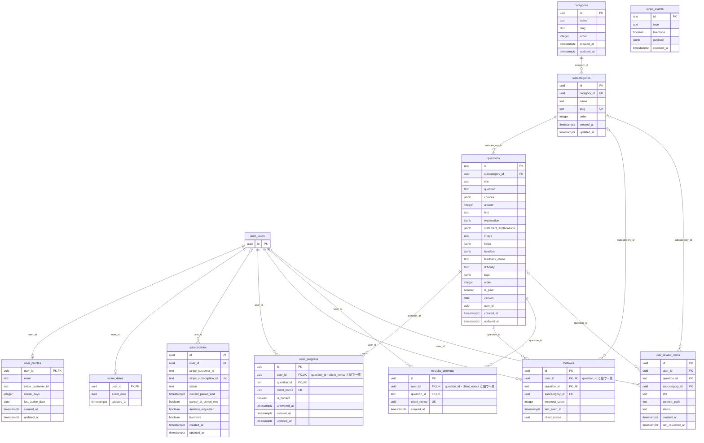
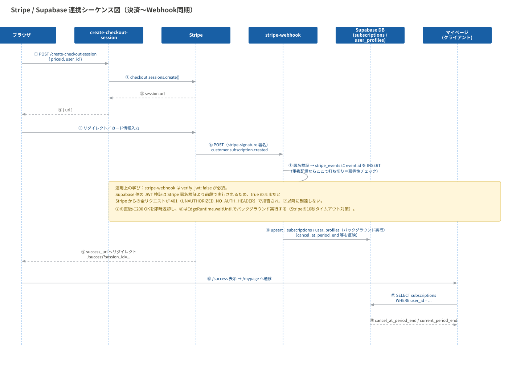

# 詳細設計（DB・設計判断）

[← README に戻る](../README.md)

## ER図（DBスキーマ）

> 本番の DB（2026年10月2日時点）の public スキーマの全テーブルと、外部キーの参照先の `auth.users`（Supabase の認証のテーブル。id の列だけを示す）です。PK は主キー、FK は外部キー、UK は一意の制約・一意の索引です。条件つきの一意の索引（`WHERE` 付き）と、ビューは図に含めていません。

## シーケンス図（決済〜Webhook同期）

## 設計判断のハイライト

### ① サブスクリプション契約履歴の保持設計

**改善前**
`subscriptions`テーブルは`user_id`にUNIQUE制約を持つ設計だった。1ユーザーにつき常に1行のみを保持する構造。

**改善後**
UNIQUE制約を`user_id`から`stripe_subscription_id`に変更。1ユーザーが複数のサブスクリプション行を持てる構造にした。

**理由**
`user_id`にUNIQUE制約がある設計では、ユーザーが解約後に再契約した場合、Stripeの新しいサブスクリプションIDを受け取っても既存の1行を上書きするしかなく、過去の契約履歴（いつ解約し、いつ再契約したか）が失われる。将来的な問い合わせ対応や解約率の分析に必要な情報が構造上残せない設計だった。制約の対象を`stripe_subscription_id`に変えることで、Stripe側の実際の契約単位とDB側の行が1対1に対応し、履歴が自然に蓄積される設計に改めた。

### ② Stripe Webhookの冪等性チェック

**改善前**
Stripeから送信されるWebhookイベントを受信する`stripe-webhook`関数側に、イベントの重複処理を防ぐ仕組みがなかった。

**改善後**
`stripe_events`テーブルを追加し、受信したイベントIDを主キーとして記録。Webhook処理の冒頭でこのテーブルに`INSERT`を試み、既に同じイベントIDが存在する場合（重複配信）は後続の更新処理をスキップするようにした。

**理由**
Stripeの公式仕様では、Webhookは「少なくとも1回」配信されることが保証されているが、「ちょうど1回」は保証されていない。ネットワーク遅延やタイムアウトにより、同一イベントが複数回配信されるケースが実際に発生しうる。冪等性チェックがない場合、サブスクリプションの状態更新処理が同じイベントに対して複数回走り、`current_period_end`の不整合といった実害につながる。`stripe_events`テーブルをイベントIDでのUNIQUE制約付きの記録台帳として使うことで、二重処理を構造的に防いだ。

### ③ mistakesテーブルの不変性保護

**改善前**
`mistakes`テーブルには`(user_id, question_id)`にUNIQUE制約（`uq_mistakes_user_question`）があり、1ユーザー・1問題につき1行のみが対応する設計だった。しかし、この行の同一性を担保する`user_id`・`question_id`・`client_nonce`をDBレベルでUPDATEから保護する仕組みがなく、アプリケーション側の実装次第で、既存の`mistakes`行がまったく別のユーザー・別の問題を指すよう書き換えられてしまう余地があった。

**改善後**
`BEFORE UPDATE`トリガー`trg_mistakes_protect_immutable`を追加。`user_id`・`question_id`・`client_nonce`のいずれかが変更されようとした場合に例外を投げ、UPDATE自体を拒否するようにした。

**理由**
`mistakes`の各行は「このユーザーがこの問題を間違えた」という事実そのものを表しており、`user_id`・`question_id`はその行のアイデンティティに相当する。誤答の記録・解除は`INSERT`・`DELETE`で行うべきものであり、これらのカラムを`UPDATE`で書き換える正当な業務要件は存在しない。アプリケーション側のバグ（例えば誤ったUPSERT処理）が発生した場合、DB側に保護がなければ既存の誤答記録が別ユーザー・別問題のものとして静かに上書きされ、学習履歴の整合性が壊れるリスクがあった。DBレベルで不変性を強制することで、アプリケーション側の実装ミスに依存しない構造的な保護にした。

### ④ 退会フローにおけるデータ整合性の統一

**改善前**
`mistakes`テーブルに論理削除用の`deleted_at`カラムが存在する一方、`user_progress`等の関連テーブルには論理削除の仕組みがなく、FKにも`ON DELETE CASCADE`が設定されていなかった。ユーザーが退会（`auth.users`からの削除）しても、`mistakes`は論理削除フラグが立つのみで物理的には残り、他の関連テーブルはFKの削除ルールが未設定のため、退会したはずのユーザーのデータが複数のテーブルに残り続ける状態だった。

**改善後**
`mistakes`から論理削除用インフラ（`deleted_at`等）を撤去し、`mistakes`・`mistake_attempts`・`user_review_items`・`user_progress`・`exam_dates`・`user_profiles`等、ユーザーの個人情報そのものを含むテーブルのFKに`ON DELETE CASCADE`を統一して設定した。一方`subscriptions`のみ`ON DELETE SET NULL`とし、`user_id`を切り離しつつ契約記録自体は残す設計にした（①で守った契約履歴が、退会によって消えてしまわないようにするため）。

**理由**
論理削除と物理削除（CASCADE）が1つのテーブル群の中に混在すると、「退会済みユーザーのデータがどこまで残っているか」をテーブルごとに個別に把握しないと判断できず、削除漏れの温床になる。乙4のような学習データサービスでは、退会後もユーザーの誤答履歴等が特定の個人と紐づいた形でDBに残り続けることは、プライバシー・個人情報保護の観点で放置できないリスクである。削除ルールをFKレベルで統一したことで、「`auth.users`から消せば、個人情報テーブルは物理削除され、契約記録は匿名化されて残る」という単一の保証をDB構造そのものに持たせ、アプリケーション側の削除処理漏れに依存しない設計にした。

### ⑤ 問題データの3段階アクセス制御

練習問題データは、認証状態とRLSによって3段階に分かれている。

| 段階 | 問題数 | 保存場所 | 条件 |
|---|---|---|---|
| 無料体験 | 32問 | 静的データ（アプリに同梱、DBを介さない） | 認証不要 |
| 無料会員 | 100問 | `questions`テーブル（`is_paid = false`） | メール登録（登録と同時にログインした状態になる。RLSでログイン済みユーザーのみ読み取り可） |
| 有料会員 | 約1,473問 | `questions`テーブル（`is_paid = true`） | 有効なサブスクリプション必須（RLS の関数 `has_active_subscription` で判定。下の「⑦ 有料会員の判定」参照） |

全1,573問のうち無料は100問（約6%）にとどめ、残りを有料の壁の奥に置くことで、検索流入で評価を得ている法令・物理化学の解説ページ（`/basics`配下、認証不要）と、収益化対象の練習問題との間でバランスを取っている。

### ⑥ DB の権限の設計

ブラウザから届く要求には読み取りだけを許し、書き込みは本人の行だけを書く関数に限っている。

| ロール | テーブル・ビュー | 関数の実行 |
|---|---|---|
| `anon`（ログインなし） | 権限なし | 権限なし |
| `authenticated`（ログイン済み） | `SELECT` のみ（読める行は RLS で決める） | 書き込みの関数6つ、読み取りの関数3つ |

- 書き込みの関数（`add_review_item`・`clear_mistake`・`mark_review_item_mastered`・`record_mistake`・`record_progress`・`set_exam_date`）は `SECURITY DEFINER`。ユーザー ID を引数で受け取らず、関数の中で `auth.uid()` を使って本人を決める
- 読み取りの関数（`get_study_days`・`pick_next_question`・`has_active_subscription`）もユーザー ID を引数で受け取らず、`SECURITY INVOKER` で RLS を通る

**理由**
ユーザー ID を引数で受け取る関数は、ID を知っていれば他人の情報を確かめられる作りだった（`has_active_subscription`）。読み書きのすべての関数を `auth.uid()` に統一し（PR #45・#60・#61）、使われていない関数・ポリシーと `anon` の権限を外した（PR #58）。これにより、クライアントが DB に書き込める経路は6つの関数だけになった。

**検証**
権限は pgTAP で確かめ、CI で PR ごとに実行している。ロールの権限を確かめるテストが10ファイル（`public_no_client_write_privileges` など）。関数が本人の記録だけを使うことは、`get_study_days()` が本人の学習日だけを返すこと（`study_days_own_only`）と、`pick_next_question` が本人の解答の記録で次の問題を選ぶこと（`next_question_own_progress`）で確かめている。あわせて、public の関数がすべて search_path を固定していること（`public_functions_fixed_search_path`）も確かめている。

### ⑦ 有料会員の判定

**対応前**：有料会員かどうかの判定が4か所に書かれており、条件は2通りあった。

| 場所 | 参照する表 | 条件 | 用途 |
|---|---|---|---|
| RLS の関数 `has_active_subscription` | `user_profiles` | 契約終了日が「現在 − 60秒」より後、または状態が `active`・`trialing`・`past_due` | 有料の問題の読み取り |
| `src/lib/subscription.ts` の `isSubscribed()` | `user_profiles` | 上と同じ | マイページの表示など |
| `src/components/SiteHeader.tsx` | `subscriptions` の最新の1行（取れなければ `user_profiles`） | 状態が `active`・`trialing`・`past_due`（契約終了日は見ない） | ヘッダーの「購入」「請求情報」の出し分け |
| `src/app/mypage/WithdrawalCard.tsx` | `subscriptions` の最新の1行 | 状態が `active`・`trialing`・`past_due`（契約終了日は見ない） | 退会の手続きの出し分け |

- 同じ条件を SQL と TypeScript で別々に書いていたため、片方だけ直すとずれる状態だった
- `has_active_subscription` は引数でユーザー ID を受け取り、`anon` にも実行を許可していた。ID を知っていれば、他人が有料会員かどうかを確かめられた
- ヘッダーと退会のカードは契約終了日を見ないため、有料の問題を読めるかどうかと、画面の出し分けが食い違う場合があった

**対応**：

- `has_active_subscription` を、引数を取らずに `auth.uid()` で本人だけを判定する関数に作り直し、`anon` の実行権限を外した（PR #45）
- 判定の条件を「`subscriptions` の本人の行のどれかの状態が `active`・`trialing`・`past_due`」に一本化し、契約終了日の条件は外した。Stripe は「期間の終わりに解約」を選んだ契約を期間の終わりまで `active` のまま保つため、使える期間は変わらない。一方で、即時に解約された契約（`canceled`）が契約終了日まで有料のまま残る状態はなくなった（PR #51）
- 画面側の `isSubscribed()` とヘッダーは、この関数を呼ぶだけにした（PR #52）
- `user_profiles` の契約の情報の列（`subscription_status`・`current_period_end`）は、Edge Functions からの書き込みをやめ、本番で Webhook の書き込みが成功することを確かめてから削除した（PR #53・#54）
- 切り替えの前後で、本番の全利用者の判定が変わらないことを確かめた

今の使われ方：

| 使う場所 | 用途 |
|---|---|
| `questions` の RLS のポリシー `read_paid_questions_with_subscription` | 有料の問題の読み取り |
| 関数 `add_review_item`・`record_progress`・`record_mistake` | 有料の問題の復習リストへの追加、解答と誤答の記録 |
| `src/lib/subscription.ts` の `isSubscribed()`（rpc で呼ぶ） | マイページの表示、次の問題の選び方、ヘッダーの「購入」「請求情報」の出し分け |

**退会の流れ**：`src/app/mypage/WithdrawalCard.tsx` と Edge Function `request-account-deletion`・`cancel-account-deletion` は、退会予約の印（`deletion_requested`）を付ける契約の行を決める必要があるため、関数ではなく契約の行そのものを読む。以前は本人の行のうち**一番新しく更新された1行**を見ていたため、解約した古い契約と再契約した新しい契約の2行を持つ利用者で、古い行が後から更新されると（Webhook のイベントが遅れて届いた場合など）、有料会員を無料会員として即時削除しうる作りだった。対象を「状態が `active`・`trialing`・`past_due` の行のうち、一番新しく更新された1行。該当する行がなければ無料会員」に変え、`has_active_subscription` と同じ考え方にそろえた（PR #56）。

**あわせて廃止したもの**：

- ビュー `user_active_subscriptions`（`subscriptions` の状態が `active`、かつ契約終了日が空または未来）は、メールアドレス未確認のユーザーを削除する関数だけが使っていた。関数を廃止して使われなくなったため、削除した（`supabase/migrations/20260928072508_drop_user_active_subscriptions_view.sql`）
- メールアドレス未確認のユーザーを削除する定期実行（`daily_unverified_cleanup`）は、本番にだけ登録されていた。関数の中で呼んでいた削除の命令（`auth.delete_user`）が存在せず、2025-09-02 の開始から一度も削除できていなかった（2026-02-21 以降は毎日失敗）。登録から確認済みになる今の設計では対象が生まれないため、関数とともに廃止した（`supabase/migrations/20260928061907_remove_unverified_cleanup.sql`）

## 型安全性

**対応済み**：`check-guest-subscription`・`stripe-webhook`にあった3箇所の`as any`を解消した。契約終了日の解決部分（2箇所）は、範囲を`PeriodEndSource`型に限定したアサーション（`as unknown as PeriodEndSource`）に変更。顧客のメールアドレス取得部分（`stripe-webhook`）は、`"deleted" in cust`による型の絞り込みに変更し、キャスト自体を排除した。

原因はStripeが2025-03-31のBasil APIバージョンで`Subscription`直下の`current_period_end`を廃止し`items.data[].current_period_end`に移行したこと。当プロジェクトはBasil以前のAPIバージョン（2024-06-20）を使っており実行時には直下のフィールドが存在するが、`esm.sh`経由で読み込む型定義はBasil以降の形を反映しているため、型とランタイムの実態がズレる。

**この対応は完全ではない**。`as unknown as PeriodEndSource`は依然として型アサーション（コンパイラに「この形だと信じてよい」と伝えるだけの記述）であり、実行時にStripeから返る値が本当にこの形をしている保証はコンパイラの外にある。抜本的な解決には、Basil以降のAPIバージョンへの全面移行（`items.data[].current_period_end`だけを正とする設計への作り替え）か、`zod`等によるスキーマ検証を実行時に挟む対応が必要になるが、どちらも決済まわり全体への影響が大きいため今回のスコープ外とした。

**Edge Functions の型の検査**：CI の `Deno.test` が型を検査するのは、テストと、テストが読み込むファイル（判定の関数を切り出した `decision.ts` など）だけで、Stripe の呼び出しや DB への書き込みがある各関数の `index.ts` は型の検査の対象外だった。CI に `deno check` を加え、7つの `index.ts` を PR ごとに検査するようにした。最初の検査で見つかった19件は、引数の型の書き忘れ（15件）、型の推論の失敗（3件。実行時の値は正しく、本番の `subscriptions` に契約の ID が空の行がないことも確認）、`EdgeRuntime` が見つからない（1件）で、いずれも動きを変えずに直した。`EdgeRuntime` は、Supabase の型定義（`edge-runtime.d.ts`）を JSR から読み込むと宣言がグローバルにならないことを、最小の再現で確かめたうえで、型だけを取り出して使う形にした。
