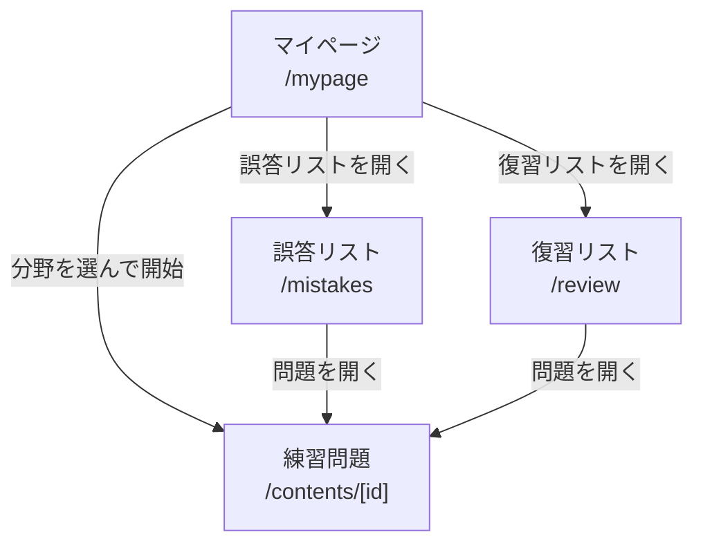
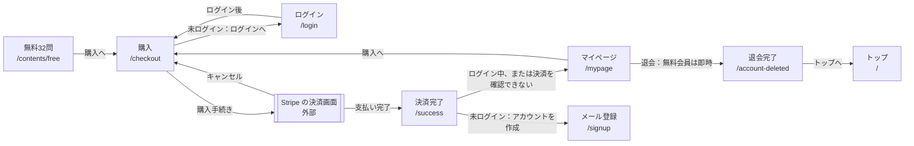
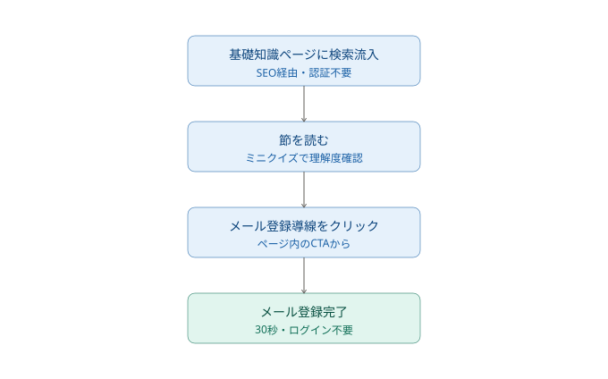
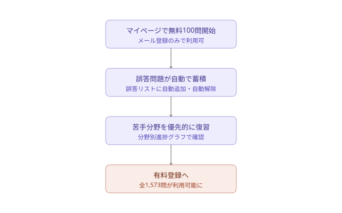

# 要件定義・基本設計

[← README に戻る](../README.md)

## プロジェクト概要（要件定義）

### 背景
危険物取扱者乙種第4類（乙4）の合格率は3割台であり（出典：[一般財団法人消防試験研究センター「試験実施状況」](https://www.shoubo-shiken.or.jp/result/)）、多くの受験者が複数回受験を経験する。一方で試験範囲自体は法改正の影響を受けにくく、出題内容が長期間にわたって大きく変化しない分野である。このため、教材としての改修コストが低く、長期的に安定した需要が見込める領域として本プロジェクトを選定した。

### 対象ユーザー（ペルソナ）
- 社会人で、就業しながら学習時間を確保する必要がある
- 乙4受験の経験があり、過去に不合格を経験している
- 独学で学習を進めており、自分の弱点分野を客観的に把握できていない
- 継続学習が苦手で、モチベーションの維持に課題がある

### 課題
既存の教材の多くは、問題を解く機能自体は提供するが、「どの分野が弱点か」「何を優先して復習すべきか」を可視化する仕組みが弱い。受験者は同じ範囲を何度も反復しても、弱点そのものが埋まらないまま再受験を繰り返すケースが多い。

### 解決アプローチ
以下の機能により、「弱点を可視化し、優先的に潰す」という学習フローを実現した。

- マイページでの分野別正答率のグラフ表示（弱点の可視化）
- 誤答リスト（不正解時に自動追加、正解で自動解除）
- 復習リスト（ユーザーが任意で追加）
- 試験日カウントダウン（残り日数の明確化）

## 機能一覧

| カテゴリ | 認証条件 | 機能 |
|---|---|---|
| 基礎知識学習 | 不要 | 節ごとのミニクイズ付き解説ページ（法令・物理化学・性質と火災予防 全3章） |
| 練習問題（無料体験） | 不要 | 無料32問体験（静的データ、簡易版のヒント・解説） |
| マイページ | メール登録（登録と同時にログインした状態になる） | ①大分野・小分野別の練習問題（大分野タップで該当分野からランダム出題、小分野タップで該当節のみ出題）　②誤答リストUI　③復習リストUI　④学習カレンダー　⑤試験日カウントダウン　⑥分野別進捗グラフ　⑦サブスクリプション購入への導線 |
| 決済 | 不要 | Stripeサブスクリプション決済。ログイン中はアカウントの ID で、ログインしていない場合は決済時のメールアドレスで、アカウントと紐付ける。Webhookで契約の状態をDBに同期 |
| 会員管理 | メール登録（ログインした状態） | 請求情報の確認・解約（Stripeのカスタマーポータル） |
| メール登録・ログイン | ― | メール登録（サインアップ）、ログイン、パスワードリセット |
| 法務・SEO | 不要 | プライバシーポリシー（問い合わせ先記載）、利用規約、特商法表記、OGP設定 |

無料の範囲は2段階に分かれる。①未登録でも使える無料32問（静的データとしてアプリに同梱、DBを介さない、認証不要）と、②メール登録後にマイページから使える無料100問（Supabaseの`questions`テーブルで`is_paid = false`、RLSでログイン済みユーザーのみ読み取り可）。残り約1,473問は有効なサブスクリプションを持つ有料会員のみ。

## 基本設計（画面遷移図・ユーザーフロー）

### 画面遷移図

画面の移動を、ヘッダーと3つの流れに分けて示す。

**ヘッダー（全画面共通）**

| 表示の条件 | リンク |
|---|---|
| 常に | トップ・基礎知識・学習ガイド |
| 未ログイン | ログイン |
| ログイン中 | マイページ・ログアウト |
| 有料会員でない（未ログインを含む） | 購入 |
| 有料会員 | 請求情報（Stripe のカスタマーポータル。戻るとマイページ） |

ヘッダーの有料会員の判定は、`subscriptions` の状態だけで行っている（[詳細設計](design.md#設計判断のハイライト) の「⑦ 有料会員の判定」参照）。

**① 登録・ログイン**

**② 学習（マイページから）**

練習問題では、解き終わると次の問題に進む。誤答リスト・復習リストから開いた場合は、最後の問題まで解くと、そのリストに戻る。

**③ 決済・退会**

- 有料会員の退会は予約になり、画面は移らない。契約終了日に `stripe-webhook` が削除する
- 法務ページ（利用規約・プライバシーポリシー・特商法表記）と、練習問題の画面からログインへの移動（復習リストへの追加時にログインが切れていた場合）は省いている

### ユーザーフロー

**検索流入からメール登録まで**

**マイページ利用開始から有料転換まで**

