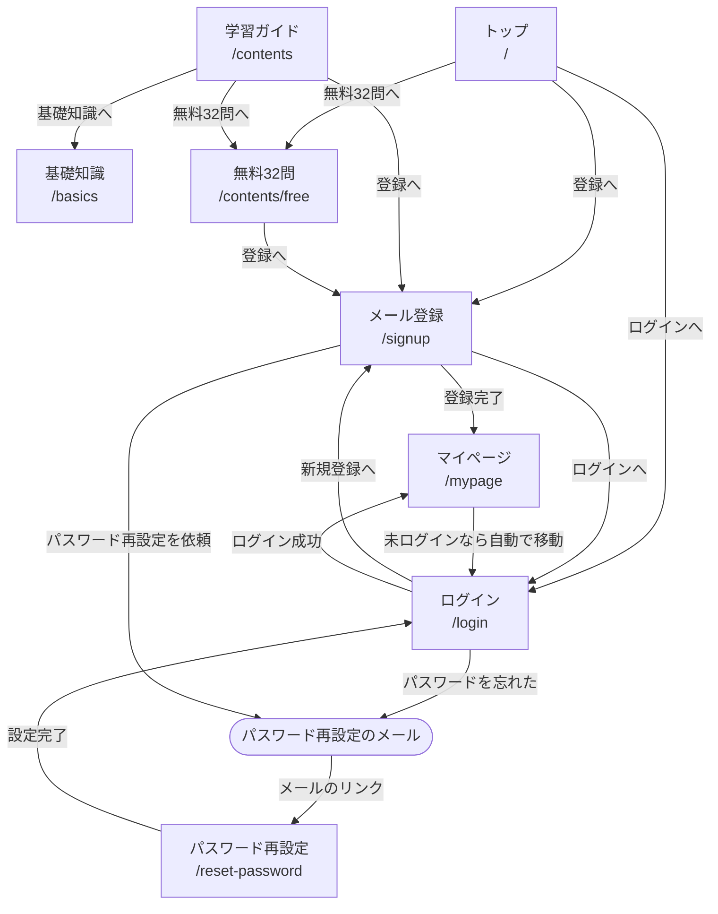
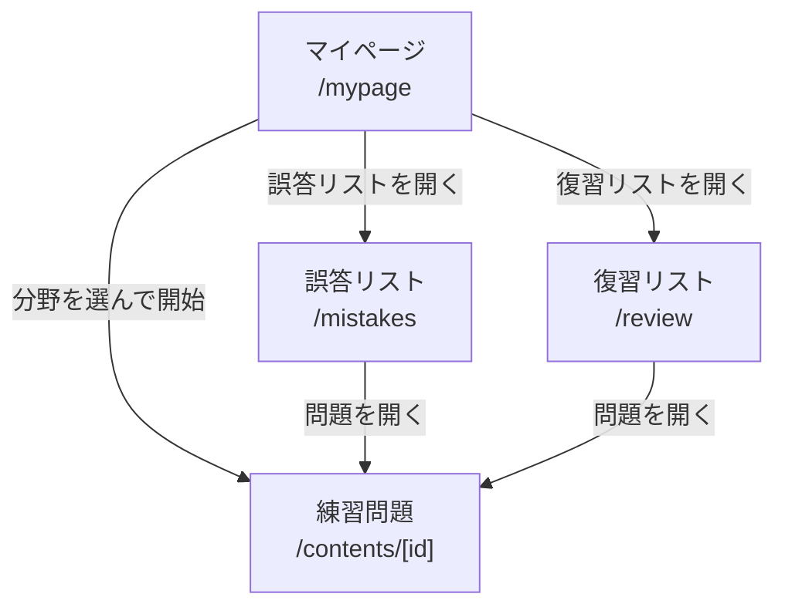
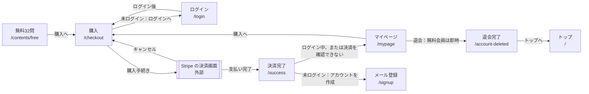
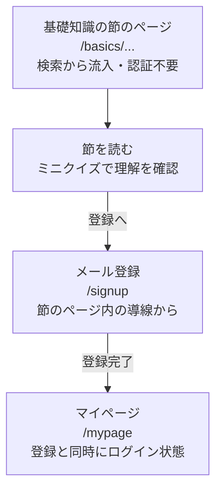
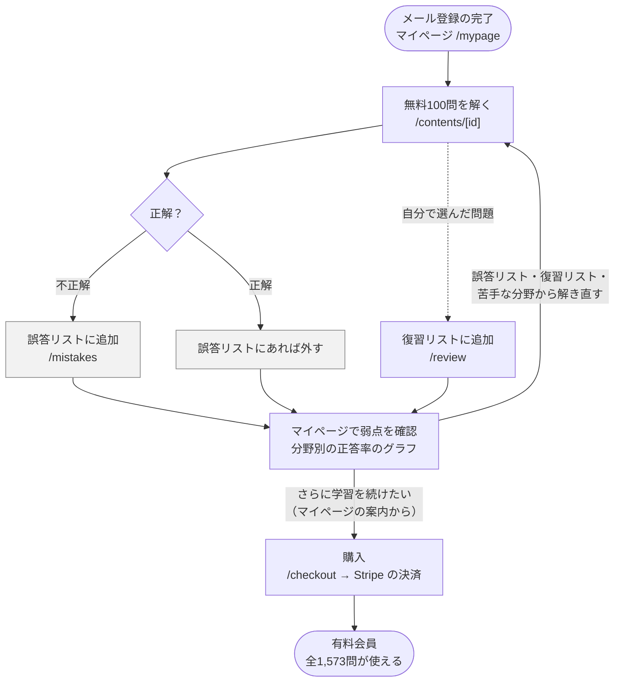

# 要件定義・基本設計

[← README に戻る](../README.md)

## プロジェクト概要（要件定義）

### 背景
危険物取扱者乙種第4類（乙4）の合格率は3割台であり（出典：[一般財団法人消防試験研究センター「試験実施状況」](https://www.shoubo-shiken.or.jp/result/)）、多くの受験者が複数回受験を経験する。一方で試験範囲自体は法改正の影響を受けにくく、出題内容が長期間にわたって大きく変化しない分野である。このため、教材としての改修コストが低く、長期的に安定した需要が見込める領域として本プロジェクトを選定した。

### 対象ユーザー（ペルソナ）
- 社会人で、就業しながら学習時間を確保する必要がある
- 乙4受験の経験があり、過去に不合格を経験している
- 独学で学習を進めており、自分の弱点分野を客観的に把握できていない
- 継続学習が苦手で、モチベーションの維持に課題がある

### 課題
既存の教材の多くは、問題を解く機能自体は提供するが、「どの分野が弱点か」「何を優先して復習すべきか」を可視化する仕組みが弱い。受験者は同じ範囲を何度も反復しても、弱点そのものが埋まらないまま再受験を繰り返すケースが多い。

### 解決アプローチ
以下の機能により、「弱点を可視化し、優先的に潰す」という学習フローを実現した。

- マイページでの分野別正答率のグラフ表示（弱点の可視化）
- 誤答リスト（不正解時に自動追加、正解で自動解除）
- 復習リスト（ユーザーが任意で追加）
- 試験日カウントダウン（残り日数の明確化）

### 扱わない範囲
- 乙4以外の類・ほかの資格の試験
- スマートフォンのアプリ（Web だけで提供する）
- 講師への質問や添削など、人による指導

### 今後追加する予定のもの
- 本番の形式・時間制限での模擬試験

## 機能一覧

| カテゴリ | 認証条件 | 機能 |
|---|---|---|
| 基礎知識学習 | 不要 | 節ごとのミニクイズ付き解説ページ（法令・物理化学・性質と火災予防 全3章） |
| 練習問題（無料体験） | 不要 | 無料32問体験（静的データ、簡易版のヒント・解説） |
| マイページ | メール登録（登録と同時にログインした状態になる） | ①大分野・小分野別の練習問題（大分野タップで該当分野からランダム出題、小分野タップで該当節のみ出題）　②誤答リストUI　③復習リストUI　④学習カレンダー　⑤試験日カウントダウン　⑥分野別進捗グラフ　⑦サブスクリプション購入への導線 |
| 決済 | 不要 | Stripeサブスクリプション決済。ログイン中はアカウントの ID で、ログインしていない場合は決済時のメールアドレスで、アカウントと紐付ける。Webhookで契約の状態をDBに同期 |
| 会員管理 | メール登録（ログインした状態） | 請求情報の確認・解約（Stripeのカスタマーポータル） |
| メール登録・ログイン | ― | メール登録（サインアップ）、ログイン、パスワードリセット |
| 法務・SEO | 不要 | プライバシーポリシー（問い合わせ先記載）、利用規約、特商法表記、OGP設定 |

無料の範囲は2段階に分かれる。①未登録でも使える無料32問（静的データとしてアプリに同梱、DBを介さない、認証不要）と、②メール登録後にマイページから使える無料100問（Supabaseの`questions`テーブルで`is_paid = false`、RLSでログイン済みユーザーのみ読み取り可）。残り約1,473問は有効なサブスクリプションを持つ有料会員のみ。

## 機能要件（受け入れ基準）

機能一覧の各機能を番号（`FR-xx`）で定義し、受け入れ基準に枝番（`FR-xx-n`）を付ける。受け入れ基準は「条件 → 期待する結果」の形で、確かめられる内容だけを書く。各基準の実現している場所と確かめ方は、[トレーサビリティ](traceability.md)に示す。

### FR-01 基礎知識

| ID | 条件 | 期待する結果 |
|---|---|---|
| FR-01-1 | ログインしていなくても | 節のページを読める |
| FR-01-2 | 節のミニクイズで選択肢を選ぶと | 正誤とその理由が表示される |

### FR-02 無料32問

| ID | 条件 | 期待する結果 |
|---|---|---|
| FR-02-1 | ログインしていなくても | 解ける（問題はアプリに同梱し、DB を使わない） |
| FR-02-2 | 回答すると | 記録がこのブラウザ（localStorage）に保存される |
| FR-02-3 | ページを開き直すと | 正解していない問題は未回答の状態に戻り、正解した問題は正解のまま残る |
| FR-02-4 | `/contents/free?reset=1` で開くと | 記録が空の状態から始まる |

### FR-03 登録・ログイン・パスワード再設定

| ID | 条件 | 期待する結果 |
|---|---|---|
| FR-03-1 | メール登録が完了すると | メールの確認なしにログインした状態になり、マイページに移る |
| FR-03-2 | ログインしていない状態でマイページを開くと | ログインに移る |
| FR-03-3 | ログイン後の移動先（`?next=`）にサイトの外の URL が渡されると | マイページに移る |
| FR-03-4 | パスワードの再設定を依頼すると | メールのリンクから新しいパスワードを設定できる |

### FR-04 練習問題と3段階のアクセス制御

| ID | 条件 | 期待する結果 |
|---|---|---|
| FR-04-1 | 無料会員が有料の問題の URL を直接開いても | 「見つからない」（404）になり、問題文は表示されない |
| FR-04-2 | 有効な契約のある有料会員が問題を開くと | すべての問題を読める |
| FR-04-3 | 分野を選んで解くと（その分野にまだ解いていない問題がある間） | 次の問題は、その分野のまだ解いていない問題から無作為に出る |
| FR-04-4 | 回答すると | 正誤が記録される |
| FR-04-5 | 無料会員が、画面を通さずに有料の問題の回答・誤答・復習の記録を送っても | DB が拒否し、記録されない |

### FR-05 誤答リスト

| ID | 条件 | 期待する結果 |
|---|---|---|
| FR-05-1 | 不正解だと | その問題が誤答リストに加わる（2回目以降は不正解の回数が増える） |
| FR-05-2 | 誤答リストにある問題に正解すると | リストから外れる |
| FR-05-3 | 誤答リストを開くと | 本人の誤答だけが表示される |

### FR-06 復習リスト

| ID | 条件 | 期待する結果 |
|---|---|---|
| FR-06-1 | 問題の画面で復習リストに追加すると | 一覧に加わる（同じ問題は重複しない） |
| FR-06-2 | 一覧で「復習済みにする」を押すと | 一覧から外れる |
| FR-06-3 | 他人の項目を復習済みにしようとしても | 変更されない |

### FR-07 学習カレンダー

| ID | 条件 | 期待する結果 |
|---|---|---|
| FR-07-1 | 1問でも回答した日（日本時間）に | カレンダーに印が付く |

### FR-08 試験日カウントダウン

| ID | 条件 | 期待する結果 |
|---|---|---|
| FR-08-1 | 試験日を保存すると | 試験日の前は「本番まで残り ○日」、当日は「今日が試験日！」、過ぎると「試験日から ○日経過」と表示される |
| FR-08-2 | 試験日を消すと | 「受験日を設定してください」の表示に戻る |

### FR-09 分野別の進捗グラフ

| ID | 条件 | 期待する結果 |
|---|---|---|
| FR-09-1 | マイページを開くと | 分野ごとに「最新の回答が正解の問題数 ÷ 解ける問題数」が表示される |
| FR-09-2 | 大分野を押すと | その分野のまだ正解していない問題から出題される。すべて正解済みなら、再挑戦するかを確かめる |

### FR-10 購入

| ID | 条件 | 期待する結果 |
|---|---|---|
| FR-10-1 | ログイン中に購入すると | 契約がそのアカウントに紐付く |
| FR-10-2 | ログインせずに購入画面を開くと | 無料会員向けの案内が表示され、ログイン後に購入画面へ戻る |
| FR-10-3 | ログインせずに購入し、同じメールアドレスで登録すると | 契約がそのアカウントに紐付く |
| FR-10-4 | 許可されていない価格で決済を始めようとすると | 拒否される |
| FR-10-5 | 許可する価格の一覧（`PRICE_IDS`）が設定されていない状態で、決済を始めようとすると | どの価格でも拒否される |

### FR-11 契約の同期

| ID | 条件 | 期待する結果 |
|---|---|---|
| FR-11-1 | Stripe の署名が正しくない通知は | 拒否される（400） |
| FR-11-2 | 同じイベントが複数回届いても | 1回だけ処理される |
| FR-11-3 | Stripe で契約が作成・更新・終了すると | `subscriptions` に反映される |

### FR-12 請求情報・解約

| ID | 条件 | 期待する結果 |
|---|---|---|
| FR-12-1 | 有料会員が請求情報を開くと | Stripe のカスタマーポータルに移り、戻るとマイページに移る |

### FR-13 退会

| ID | 条件 | 期待する結果 |
|---|---|---|
| FR-13-1 | 無料会員が退会すると | アカウントがすぐに削除される |
| FR-13-2 | 有料会員は、Stripe で解約の手続きを済ませたときだけ | 退会を予約でき、契約終了日に削除される |
| FR-13-3 | 退会の予約を取り消すと | 予約がなくなる |

### FR-14 法務ページ

| ID | 条件 | 期待する結果 |
|---|---|---|
| FR-14-1 | ログインしていなくても | 利用規約・プライバシーポリシー・特商法表記を読める |

## 非機能要件

IPA の非機能要求グレードの大項目で分類し、`NFR-<大項目の略号>-xx` の番号を付ける。FR-03-3・FR-04-5・FR-11-1 は、セキュリティの要件も兼ねる。各要件の確かめ方は、[トレーサビリティ](traceability.md#非機能要件)に示す。

### 可用性（AV）

| ID | 要件 |
|---|---|
| NFR-AV-01 | 稼働率の目標：月 99.5%（保証ではなく目標。依存先の障害を含む） |
| NFR-AV-02 | RTO（アプリの不具合）：検知から30分以内。Vercel の Instant Rollback で、本番に出したことのある任意の版に即時に戻せる（Pro） |
| NFR-AV-03 | RTO（Edge Functions の不具合）：検知から30分以内。PR を戻してマージすると自動でデプロイされる（2026-10-08 の手動実行は31秒） |
| NFR-AV-04 | RTO（DB のデータの破損・消失）：検知から3時間以内（未計測）。毎日のバックアップから復元する。復元の間はサービスが止まり、所要時間は DB の大きさで決まる（公式に時間の記載なし） |
| NFR-AV-05 | RPO（DB）：24時間（毎日のバックアップ、7日分） |
| NFR-AV-06 | Storage のファイル（問題の図）は DB のバックアップに含まれず、今は復元できない（今後の課題） |
| NFR-AV-07 | Vercel・Supabase・Stripe 側の障害は、先方の復旧に従う（RTO の対象外） |

### 性能・拡張性（PE）

| ID | 要件 |
|---|---|
| NFR-PE-01 | 主要4ページの LCP が 2,500ms 以下（Lighthouse CI の3回の中央値）。4,000ms を超えたら CI を失敗にする |
| NFR-PE-02 | CLS が 0.1 以下。超えたら CI を失敗にする |
| NFR-PE-03 | TBT が 200ms 以下、Performance・Accessibility のスコアが 0.9 以上（下回ったら警告） |

### 運用・保守性（OM）

| ID | 要件 |
|---|---|
| NFR-OM-01 | 対応する時間帯：毎日 7:00〜19:00。時間外の障害は翌日 7:00 から数える |
| NFR-OM-02 | 本番への変更（マージ・デプロイ・migration）は対応時間帯の中で行い、18:00 以降は行わない |
| NFR-OM-03 | 障害の検知：`stripe-webhook` とトップのページを3分ごとに確かめる（Better Stack）。`stripe-webhook` の本文は GitHub Actions で補う |
| NFR-OM-04 | 画面とサーバーのエラーを記録する。利用者を特定できる情報は送らない |
| NFR-OM-05 | 異常はすべてメールで知らせる |
| NFR-OM-06 | main への変更は PR を通し、CI（Vitest・ESLint・Deno・E2E・pgTAP・Lighthouse CI）が成功してからマージする（運用の決まり）。main のルールセットで強制しているのは、削除と force push の禁止だけ |

### 移行性（MG）

| ID | 要件 |
|---|---|
| NFR-MG-01 | 対象外（旧版からの移行は完了済みで、今後の移行の予定はない） |

### セキュリティ（SE）

| ID | 要件 |
|---|---|
| NFR-SE-01 | ブラウザには DB の読み取りだけを許し、書き込みは本人を `auth.uid()` で決める関数に限る。読める行は RLS で決める |
| NFR-SE-02 | Edge Functions は、リクエストの JWT から本人を決め、本文のユーザー ID を使わない |
| NFR-SE-03 | Stripe の秘密鍵・Webhook の署名の鍵は Edge Functions の環境変数だけに置く |
| NFR-SE-04 | 過去に漏えいしたパスワードでの登録・変更を拒否する |

### システム環境・エコロジー（EN）

| ID | 要件 |
|---|---|
| NFR-EN-01 | 稼働環境：Vercel（Pro）、Supabase（Pro）、Stripe |
| NFR-EN-02 | 動作を確かめているブラウザ：Chromium（E2E・Lighthouse CI） |

## 基本設計（画面遷移図・ユーザーフロー）

### 画面遷移図

画面の移動を、ヘッダーと3つの流れに分けて示す。

**ヘッダー（全画面共通）**

| 表示の条件 | リンク |
|---|---|
| 常に | トップ・基礎知識・学習ガイド |
| 未ログイン | ログイン |
| ログイン中 | マイページ・ログアウト |
| 有料会員でない（未ログインを含む） | 購入 |
| 有料会員 | 請求情報（Stripe のカスタマーポータル。戻るとマイページ） |

ヘッダーの有料会員の判定は、`subscriptions` の状態だけで行っている（[詳細設計](design.md#設計判断のハイライト) の「⑦ 有料会員の判定」参照）。

**① 登録・ログイン**

**② 学習（マイページから）**

練習問題では、解き終わると次の問題に進む。誤答リスト・復習リストから開いた場合は、最後の問題まで解くと、そのリストに戻る。

**③ 決済・退会**

- 有料会員の退会は予約になり、画面は移らない。契約終了日に `stripe-webhook` が削除する
- 法務ページ（利用規約・プライバシーポリシー・特商法表記）と、練習問題の画面からログインへの移動（復習リストへの追加時にログインが切れていた場合）は省いている

### ユーザーフロー

**検索流入からメール登録まで**

**マイページ利用開始から有料転換まで**

灰色の箱はシステムが自動で行う処理、点線は利用者が任意で行う操作。
